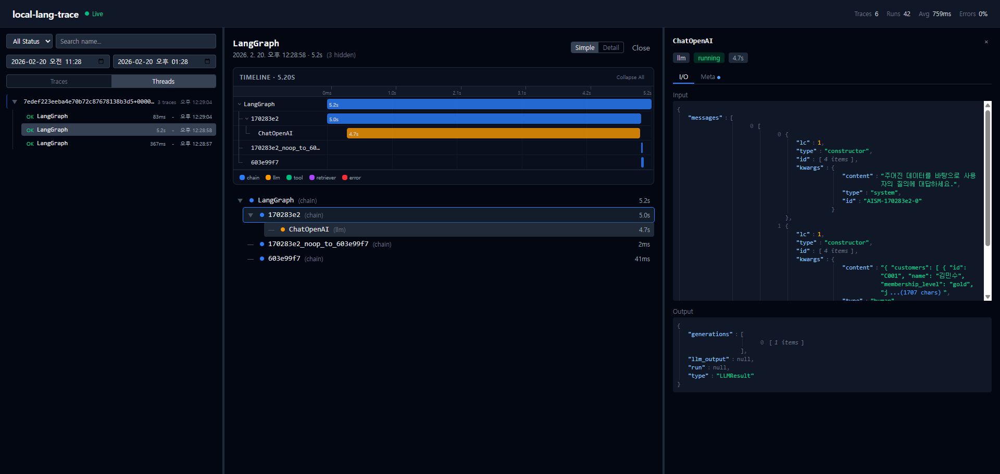

# local-lang-trace

LangSmith 없이 로컬에서 동작하는 경량 LangChain Trace 수집/저장/시각화 도구.

기존 LangChain 코드의 환경변수 하나만 바꾸면 바로 연동됩니다.



## 아키텍처

```
LangChain App
  └─ LANGSMITH_ENDPOINT=http://localhost:4318
        │
        ▼  HTTP POST /runs/batch
┌──────────────────────────────────┐
│          Fastify Server          │
│                                  │
│   Circular Buffer (in-memory)    │
│        │ flush (시간/건수)        │
│        ▼                         │
│   better-sqlite3 (traces.db)     │
│        │ onFlush                 │
│        ▼                         │
│   SSE broadcast ──→ React SPA    │
└──────────────────────────────────┘
```

## 빠른 시작

```bash
# 설치
npm install

# UI 빌드
npm run build:ui

# 서버 실행
npm start
```

서버가 시작되면:
- Viewer UI: http://localhost:4318/ui
- Health: http://localhost:4318/api/health

## LangChain 연동

Python:
```bash
LANGSMITH_TRACING=true
LANGSMITH_ENDPOINT=http://localhost:4318
LANGSMITH_API_KEY=local
python your_app.py
```

JavaScript/TypeScript:
```bash
LANGCHAIN_TRACING_V2=true
LANGCHAIN_ENDPOINT=http://localhost:4318
LANGCHAIN_API_KEY=local
node your_app.js
```

## 주요 기능

- **LangSmith 호환**: `/runs/batch`, `/runs`, `PATCH /runs/:id`, `/info` 엔드포인트 지원
- **실시간 업데이트**: SSE(Server-Sent Events)를 통한 라이브 트레이스 스트리밍
- **3-Column 뷰어**: Trace 목록 | Waterfall + RunTree | Run I/O 상세
- **리사이즈 가능한 패널**: 드래그로 컬럼 너비 조절
- **Waterfall Timeline**: run_type별 색상 바, 트리 커넥터, 접기/펼치기
- **인터랙티브 JSON 뷰어**: 타입별 색상, 접기/펼치기, 긴 문자열 축약
- **Simple/Detail 뷰 모드**: Simple 모드에서 `langsmith:hidden` 태그된 run 자동 숨김
- **Thread 그룹핑**: thread_id 기준으로 trace를 그룹화하여 탐색
- **SDK 메타데이터 수집**: tags, serialized, events, session_id 등 미매핑 필드 자동 저장
- **필터링**: 상태(성공/에러), 이름 검색, 기간별 필터
- **자동 정리**: TTL 기반(기본 3일) + DB 크기 기반(기본 200MB) 자동 삭제
- **무한 스크롤**: 대량 트레이스도 부드럽게 탐색

## 환경변수

| 변수 | 기본값 | 설명 |
|---|---|---|
| `PORT` | `4318` | 서버 포트 |
| `DB_PATH` | `./traces.db` | SQLite DB 파일 경로 |
| `BUFFER_MAX_SIZE` | `1000` | 메모리 버퍼 최대 크기 |
| `FLUSH_INTERVAL_MS` | `5000` | 시간 기반 flush 주기 (ms) |
| `FLUSH_BATCH_SIZE` | `100` | 건수 기반 flush 임계값 |
| `TTL_DAYS` | `3` | 트레이스 보존 기간 (일) |
| `MAX_DB_SIZE_MB` | `200` | DB 파일 최대 크기 (MB) |
| `VACUUM_ON_CLEANUP` | `false` | 정리 후 VACUUM 실행 여부 |

`.env.example`을 `.env`로 복사하여 설정을 변경할 수 있습니다.

## API

### 수집 (LangSmith 호환)

| Method | Path | 설명 |
|---|---|---|
| `GET` | `/info` | SDK 핸드셰이크 |
| `POST` | `/runs/batch` | Run 일괄 수신 |
| `POST` | `/runs` | 단건 Run 수신 |
| `PATCH` | `/runs/:id` | Run 업데이트 |

### 뷰어 API

| Method | Path | 설명 |
|---|---|---|
| `GET` | `/api/traces` | 트레이스 목록 (페이지네이션, 필터, `?thread_id=` 지원) |
| `GET` | `/api/traces/:traceId` | 트레이스 상세 (Run 트리) |
| `GET` | `/api/threads` | 스레드 목록 (thread_id별 그룹 집계) |
| `GET` | `/api/stats` | 통계 (토큰, 지연시간, 에러율) |
| `GET` | `/api/health` | 서버 상태 |
| `GET` | `/api/events` | SSE 실시간 스트림 |

## 개발

```bash
# 서버 (파일 변경 시 자동 재시작)
npm run dev

# UI 개발 서버 (HMR, /api는 :4318으로 프록시)
npm run dev:ui

# 테스트
npm test

# 단일 테스트 파일
cd packages/server && node --test src/buffer.test.js
```

## 기술 스택

| 영역 | 기술 |
|---|---|
| 서버 | Fastify, better-sqlite3, dotenv |
| 프론트엔드 | React 18, Vite, Tailwind CSS v4 |
| 상태 관리 | Zustand |
| 데이터 패칭 | SWR + SSE |
| 테스트 | Node.js 내장 테스트 러너 (`node:test`) |

## 프로젝트 구조

```
local-lang-trace/
├── packages/
│   ├── server/src/
│   │   ├── index.js          # 서버 진입점
│   │   ├── buffer.js         # Circular Buffer
│   │   ├── db.js             # SQLite 래퍼 (마이그레이션 포함)
│   │   ├── flusher.js        # Buffer → DB flush + 메타데이터 수집
│   │   ├── sse.js            # SSE 이벤트 브로드캐스터
│   │   └── routes/
│   │       ├── ingest.js     # /runs/* LangSmith 호환
│   │       └── api.js        # /api/* 뷰어 API
│   └── ui/src/
│       ├── App.jsx           # 3-Column 리사이즈 레이아웃
│       ├── store.js          # Zustand 스토어
│       ├── pages/
│       │   ├── TraceList.jsx     # Traces/Threads 토글, 필터, 무한 스크롤
│       │   └── TraceDetail.jsx   # Simple/Detail 뷰 모드, Waterfall + RunTree
│       └── components/
│           ├── RunTree.jsx       # 트리 구조 + run_type 색상 dot
│           ├── RunDetail.jsx     # I/O + Meta 탭
│           ├── JsonViewer.jsx    # 인터랙티브 JSON 트리 뷰어
│           ├── PromptViewer.jsx  # Input/Output 표시
│           ├── WaterfallTimeline.jsx  # 타임라인 바 차트
│           └── StatsPanel.jsx    # 헤더 인라인 통계
├── .env.example
└── package.json              # npm workspaces 루트
```

## 라이선스

MIT
